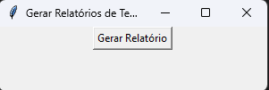

# Gerador de Relatórios de Temperatura e Umidade

Este é um projeto de automação que utiliza Python, Selenium, OpenPyXL e Tkinter para criar relatórios de temperatura e umidade do ar. O programa automatiza a busca de informações no Google e salva os dados em um arquivo Excel.

## 📋 Funcionalidades

### Automação com Selenium
- Pesquisa a temperatura atual no Google.
- Extrai informações como a temperatura e alerta de umidade do ar.

### Manipulação de Planilhas Excel
- Salva a temperatura, umidade e a data/hora em um arquivo Excel (`historico_temperatura.xlsx`).
- Cada execução insere os dados na próxima linha disponível.

### Interface Gráfica com Tkinter
- Permite executar o programa através de um botão "Gerar Relatório".

## 🔧 Tecnologias Utilizadas

- **Linguagem:** Python 3.11+
- **Bibliotecas:**
    - `selenium`: Para automação do navegador.
    - `openpyxl`: Para manipulação de arquivos Excel.
    - `tkinter`: Para criação da interface gráfica.
    - `datetime` e `time`: Para manipulação de tempo e datas.


## 📂 Estrutura do Projeto

```
GeradorRelatorios/
├── 📜 historico_temperatura.xlsx  # Arquivo Excel onde os dados são salvos
├── 📜 clima.py                     # Código principal do programa
└── 📜 README.md                   # Documentação do projeto
```

## 🛠️ Configuração do Ambiente

### 1. Instale o Python
Certifique-se de que o Python 3.11+ esteja instalado. [Baixar Python](https://www.python.org/downloads/)

### 2. Instale as Dependências
Execute os seguintes comandos para instalar as bibliotecas necessárias:

```bash
pip install selenium openpyxl
```

### 3. Configure o WebDriver
Faça o download do ChromeDriver compatível com a versão do seu navegador Chrome: [ChromeDriver](https://sites.google.com/a/chromium.org/chromedriver/downloads). Certifique-se de que o executável `chromedriver` está no mesmo diretório do projeto ou configurado no PATH do sistema.

## ▶️ Como Executar

### Clone o Repositório:
```bash
git clone https://github.com/estudoalexandre/fecaf-clima-tempo.git
cd gerador-relatorios
```

### Inicie o Programa:
Execute o programa principal:
```bash
python clima.py
```

### Use a Interface Gráfica:
Clique no botão "Gerar Relatório" para executar o fluxo automatizado. Após a execução, um arquivo chamado `historico_temperatura.xlsx` será atualizado com os dados.

## 🖥️ Demonstração

### Interface Gráfica (Tkinter):


## ⚙️ Fluxo do Programa
1. O usuário clica no botão "Gerar Relatório".
2. O programa:
    - Abre o navegador Chrome usando o Selenium.
    - Pesquisa a temperatura atual no Google.
    - Captura a temperatura e a umidade do ar.
    - Salva os dados no Excel com a data e hora.
3. Ao final, o navegador é fechado e os dados são exibidos no console.

## ⚠️ Possíveis Problemas

### Erro ao iniciar o ChromeDriver:
Certifique-se de que o ChromeDriver está instalado e configurado corretamente.

### XPath quebrado:
Caso o Google altere a estrutura da página, pode ser necessário atualizar os seletores XPath.

### Permissões no arquivo Excel:
Certifique-se de que o arquivo `historico_temperatura.xlsx` não está aberto em outro programa.


